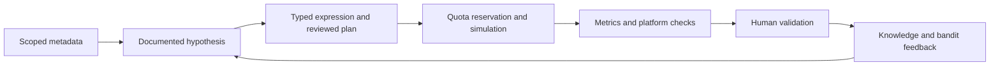

# Alpha Research

A local quantitative research workbench for WorldQuant BRAIN. It connects documented data discovery, explicit hypotheses, reusable expression templates, bounded simulation campaigns, and human review in one auditable workflow.

**Status:** working research prototype with a local browser interface and PostgreSQL persistence. Manual research and alpha redevelopment require no LLM API subscription. A BRAIN account with the appropriate access is required for catalogue discovery and remote simulations.

[Setup and operation](HOW_TO_RUN.md) · [Research portfolio](docs/RESEARCH_PORTFOLIO.md) · [Architecture](docs/ARCHITECTURE.md) · [Public/private files](docs/PUBLICATION.md) · [Security](SECURITY.md)

## The research problem

A large field catalogue makes it easy to generate many expressions without understanding the data or keeping track of experimental choices. This project makes the hypothesis, documented field evidence, expression structure, settings, results, and researcher decisions inspectable. Its contribution is the research workflow and engineering around experimentation; it does not claim that automatic generation guarantees investment returns.

## What works today

| Capability | Behavior |
| --- | --- |
| Scoped catalogue sync | Discover account-visible region, delay and universe settings; select datasets, coverage thresholds and a field limit. Interrupted downloads retain pages and respect BRAIN rate limits. |
| Submitted alpha library | Import every account-visible submitted alpha page into a private, searchable history. Refresh, resume interrupted downloads, filter by submission date, export all matching records, or develop a saved expression further. |
| Data Explorer | Browse scope → category → dataset → fields. Filter coverage and reported alpha count; the default count bounds are strictly greater than 5 and less than 500. Export all matching saved metadata as JSON. |
| Manual research | Supply expressions and review their fields and supported operators before starting a campaign. No paid LLM is required. |
| Template variants | Resolve missing fields in the chosen scope and rank compatible replacement candidates using documented metadata and coverage. Semantic equivalence still requires researcher review. |
| Alpha redevelopment | Decompose an existing expression; test controlled slope, residual, historical-standardization and joint-strength hypotheses while retaining supported neutralization. Record parent lineage and comparable saved metrics. |
| Provider-assisted research | Optional OpenAI, Gemini, Claude and Groq adapters. Providers use supplied metadata evidence; API credentials are excluded from prompts and database records. Model access and quotas depend on the provider account. |
| Simulation review | Persist reservations before remote submission, prevent duplicate structures, show reported progress and errors, and allow stopping queued work or local monitoring. |
| Human validation | Stop dispatching after four qualifying candidates, then collect user decisions. Already running work may yield additional results. Missing required checks or metrics cannot qualify. |
| Learning history | Persist versioned UCB bandit decisions, rewards and feedback. This is an inspectable learning policy, not evidence that performance improves every day. |

## Try it without an account

From this repository's `alpha-research-platform` directory, with Python 3.11 or later:

```sh
python -m venv .venv
# Activate the environment using the command for your operating system.
python -m pip install -r requirements.txt
python -m alpha_platform.cli preview --count 10 --seed 42
python -m unittest discover -s tests/unit -v
```

`preview` generates deterministic candidate structures without PostgreSQL, BRAIN authentication, LLM calls, or simulation quota. Generated expressions are examples to investigate, not verified profitable alphas.

## Run the full workbench

1. Install Python 3.11+ and PostgreSQL 16. Docker Desktop is optional.
2. Copy `.env.example` to `.env` and replace the database password. Keep `.env` private.
3. Create the configured database, or run `docker compose up -d postgres` with the included configuration.
4. Apply migrations and launch the server from the project directory:

   ```sh
   python -m alembic upgrade head
   python -m alpha_platform.cli doctor
   python -m alpha_platform.cli serve
   ```

5. Open **http://127.0.0.1:8765**. Connect through **Sync with BRAIN** and complete any biometric verification in the supplied link. Create and review a research project, then choose **Start** to authorize simulations.

Windows users can use `scripts/Start-Research.ps1` after installing dependencies. See [HOW_TO_RUN.md](HOW_TO_RUN.md) for activation, database setup, recovery, field exports and troubleshooting. Run the dashboard from this source checkout; the dashboard and database migrations are repository assets.

## Design and engineering

The interface uses warm neutral surfaces, restrained green accents, serif headings and dense research tables. Navigation separates catalogue discovery, research plans, simulation progress, validation and knowledge history.



The Python backend uses FastAPI, SQLAlchemy and PostgreSQL. A typed expression parser supports a reviewed subset of FASTEXPR. Dataset and field rows use scope-qualified keys, indexed filters and preserved source metadata. Background workers run inside one local server process. [Architecture and trade-offs](docs/ARCHITECTURE.md) explains the boundaries.

## Validation and reproducibility

Unit tests cover parsing, operator options, provider failures, metadata selection, pagination recovery, quota protection, redevelopment and evaluation. PostgreSQL integration tests create disposable schemas and mock remote simulations. Browser checks cover navigation, progress, catalogue filters, JSON export and refresh stability.

```sh
python -m unittest discover -s tests/unit -v
# Requires a configured PostgreSQL instance with CREATE SCHEMA permission:
python -m unittest discover -s tests/integration -v
```

GitHub Actions runs tests against a fresh PostgreSQL service and checks publication hygiene. The public repository uses synthetic test fixtures and source code; it does not include the author's account data, private alpha outcomes, authentication cookies or catalogue downloads.

## Limits and research integrity

- Catalogue downloads are **metadata**, not raw historical observations. Coverage and alpha counts are reported metadata, not independent quality measurements.
- A local cap of up to 5,000 simulations per UTC day and selectable concurrency up to 200 do not override BRAIN's actual account limits. Start conservatively and follow reported limits.
- Backtest thresholds are selection rules, not out-of-sample performance evidence. No scholarship, profitability, or production suitability is promised.
- A timeout after submission can leave an uncertain remote outcome. Its reservation is retained; it is not automatically resubmitted.
- Submitted history requires a current BRAIN session. Only numeric scores returned by BRAIN are shown; missing scores and checks remain unknown. Imported history does not use simulation quota.
- Stopping local tracking does not cancel a remote BRAIN simulation. Production alpha submission remains a human decision.
- The current portfolio page is a validated collection, not a combined portfolio backtest. Distributed workers, independent holdout evaluation and continuous plan refinement are future work.
- Optional embedding modules are experimental. Install `pip install -e ".[embeddings]"` only if using them; their similarity scores do not authorize simulations.

## For academic reviewers

This project demonstrates research-oriented software engineering: formal expression representation, hypothesis-controlled experimentation, durable state, failure-aware API integration, data provenance, reproducibility, and a contextual learning workflow. The [research portfolio](docs/RESEARCH_PORTFOLIO.md) separates implemented contributions from proposed experiments and outlines an evaluation plan suitable for further study. It contains no invented credentials, benchmark scores, publication claims or confidential performance results.

## Attribution and reuse

The BRAIN client includes ACE helper code retained from the repository's existing `ACE_API__Gold_ (1)` materials. See [THIRD_PARTY_NOTICES.md](THIRD_PARTY_NOTICES.md). This project is independent of WorldQuant and is not presented as an endorsed product. Public visibility does not by itself grant a software license; no new license has been assigned to third-party material.
